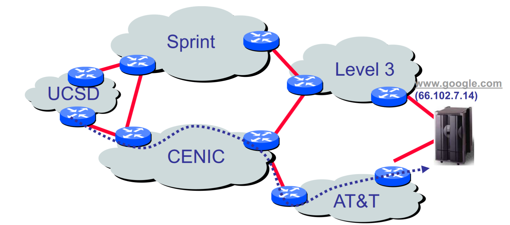

# CSE 123
### Go to office hours.

## A "Simple" Task
- Send information from one computer to another 
    - Endpoints are called hosts
        - Computers, iPhone, laptop, etc.
    - The plumbing is called a link
        - Copper wire, optical fiber, wireless, etc.

- Web Request (HTTP)

- Name Resolution (DNS)

- Data Transport (TCP)
    - Breaks messages into packets
    - Should be delivered reliably and in order

- Global network addressing
    - Address each packet so it can traverse network and arrive at host

- Network Routing
    - Each router forwards packet towards destination

- Link Management (WiFi)

- Physical Layer
