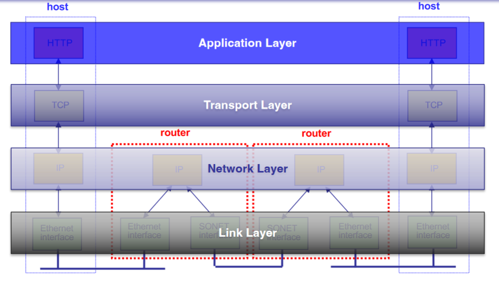
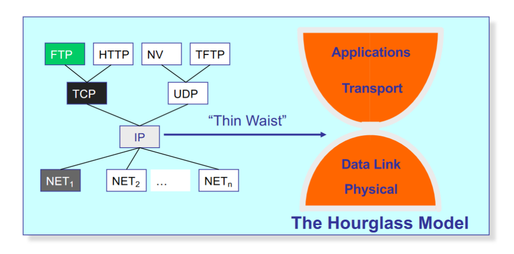
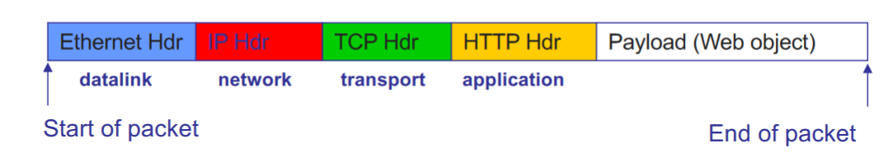

# Layers and Framing

## Layering: A Modular Approach
- Sub divide the problem
    - Each layer relies on servces from layer below
    - Each layer exports services to layer above
- Interface between layers defines interaction
    - Hides implementation details (encapsulation)
    - Layers can change without disturbing other layers (modularity)
- Interface among peers in a layer is a protocol
    - If peers speak same protocol, they can interoperate

## Key Design Decision
- How do you divide functionality across the layers?
- End-to-end argument [Saltzer84]
    - Functionality should be implemented at a lower layer if and only if it can be correctly and completely implemented there
- Early, and still relevant, example: Reliability
    - ARPAnet (low layer) provided reliable link transfers between stitches
    - Was this enough for reliable communication?
    - No , packets could still get corrupted on host-switch link, or inside of the switches
    - Hence, still need reliability at higher layers
        - Using hashes to verify downloaded files

## Protocol Standardization
- Communicating hosts speaking the same protocol
    - Standardization to enable multiple implementations
- Internet Engineering Task Force
    - Based on working groups that focus on specific issues
    - Produces "Request For Comments" (RFCs)
        - Rough consensus and running code
        - After enough time passes, promoted to Internet Standards
- Other standards bodies exist

## TCP/IP Protocol Stack

## Internet Protocol Suite

## Encapsulation via Headers
- Typical Web Packet

- Notice that layers add overhead
    - Space (headers), effective bandwidth
    - Time (processing headers, "peeling the onion"), latency

## Physical/Link Layer
- Signal encoding
    - Encode binary data from source node into signals that physical links carry
    - Signal is decoded back into binary data at receiving node
    - Work performed by network adapter at sender and receiver
- Media access
    - Arbitrate which nodes can send frames at any point in time
    - Not always necessary; i.e. point-to-point duplex links

## (Data) Link Layer
- Framing
    - Break stream of bits up into discrete chunks
- Error handling
    - Detect and/or correct errors in received frames
- Multiplexing
    - Determine appropriate destination for a given frame
    - Also not always required; again, point-to-point

## Framing
- Break down a stream of bits into smaller, digestible chunks called frames
    - Identify te beginning and the end of the bitstream
- Allows the link to be shared
    - Multiple senders and/or receivers can time multiplex the link
    - Each frame can be separately addressed
- Provides manageable unit of rerror handling
    - Eady to determine whether something went wrong
    - And perhpas even to fix it if desired

## What's a Frame?

- Wraps payload up with some additional information
    - Header ususlaly contains addressing info
    - Maybe includes a trailer (w/checksum)
- Basic unit of reception
    - Link either delivers entire frame payload, or none of it
    - Typically, some maximum transmission unit (MTU)
- Some link layers require absence of frames as well
    - i.e. minimum gaps between frames

## Identifying frames
- First task is to delineate frames
- Several different alternatives:

### Fixed-Length Frames
- Easy to manage for receiver
- Introduces inefficiencies for variable length payloads
    - May waste space for small payloads
    - Larger payloads need to be fragmented across many frames
    - Very common inside switches
- Requires explicit design tradeoff

### Length--Based Framing

- To avoid overhead, we'd like variable length frames
    - Each frame declares how long it is
- What's the issue with explicit length field?
    - Must correctly read the length field (bad if corrupted)
        - Need to decode while receiving
    - Still need to identify te beginning...