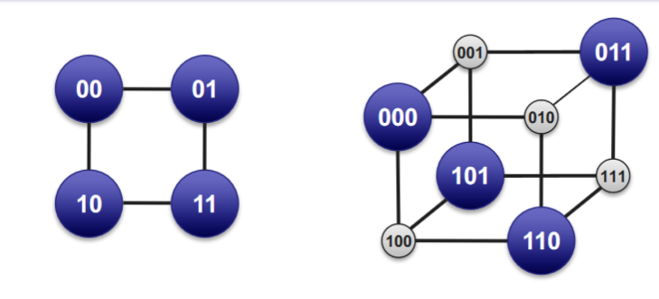

# Identifying Frames

### Sentinel-Based Framing
- Allow for variable length frames
- Idea: mark start/end of frame with special "marker"
- But... must make sure marker doesn't appear in data
- Two solutions
    - Stuffing
        - Dynamically remove bit patterns from data stream
        - Receiver "unstuffs" data stream to reconstruct original data

## Stuffing

- Insert bytes/bits into data stream to make sure that sentinel (flag) does not appear in payload

### Bit-Level Stuffing
- Avoid sentinel bit pattern in payload data
    - Commonly, sentinel is bit pattern 01111110 (six ones, 0x7E)
- Sender: any time five ones appear in outgoing data, insert a zero, resulting in 0111110

- Receiver: any time five ones appear, removes next zero
    - If there is no zero, there will either be six ones (sentinel) or
    - It declares an error condition!
    - Note: bit pattern that cannot appear is 01111111 (0x7F)

### Byte Stuffing aka "Escaping"
- Same as bit stuffing, except at byte (character) level
    - Generally have two different flags, STX and ETX
- Need to stuff if either appears in the payload
    - Prefix with another special character, DLE (data-link-escape)
    - New problem: what if DLE appears in payload?
- Stuff DLE with DLE
    - Could be as bas as 50% efficient to send all DLEs

## Clock-Based Framing
- An alternative is to base framing on external clock
    - This is what SONET does, among others
- Significant engineering tradeoffs
    - No extra bits needed in the data stream itself, but...
    - Need tight clock synchronization between sender and receiver
- Chip Scale Atomic Clocks are REALLY expensive

# When Things Go Wrong
- Clock drift may confuse frame boundaries
    - Read the end of one frame and begninning of the next
- What happens if there are bit errors on channel?
- In general, need some way to make sure we're OK
    - Error detection, and perhaps correction

## Per-Frame Detection Codes
- Want to add an error detection code per frame
    - Frame is unit of transmission; all or nothing
    - Computed over the entire frame-including header. Why?
- Receiver checks EDC to make sure frame is valid
    - If frame fails check, throw it away
- We could use error-correcting codes
    - But they are less effiecient, and we expect errors to be rare
    - Counter example: satellite communication

## Error-Detecting Codes
- Implemented at many layers
    - We'll mainly focus on link-layer techniques today

## Basic Idea: Coding
- The problem is data itself is not self-verifying
    - Every string of bits is potentially legitimate
    - Hence, any errors/changes in a set of bits are equally legit
- The solution is to reduce the set of potential bitstrings
    - Not every string of bits is allowable
    - Receipt of a disallowed string of bits means the original bits were garbled in transit
- Then: which bitstrings are allowed?

## Codewords
- Let's start simple, and consider fixed-length bitstrings
    - In practice, we likely want to do it for a whole frame
    - For now, let's reduce our discussion to n-bit substrings
- We call an allowable sequence of n bits, a codeword
    - Not all strings of n bits are codewords
    - The remaining n-bit strings are "space" between codewords

## Hamming Distance

- Distance between legal codewords
    - Measured in terms of bit flips
- Efficient codes are of uniform hamming distance
    - All codewords are equidistant from their neighbors

### 2d+1 Hamming Distance
- Can detect up to 2d bit flips
    - The next codeword is always 2d+1 bit flips away
    - Any fewer is guaranteed to land in the middle
- Can correct up to d bit flips
    - We just move to the closest codeword
    - Unfortunately, no way to tell how many bit flips

# Encoding
- We're going to send only codewords
    - Non-codewords indicate errors to receiver
- But we want to send any set of strings
    - Need to embed arbitrary input into sequence of codewords

## Simple Detection
### Parity

- Add extra bit to ensure odd(even) number of ones
    - Code has a rate of 2/3 (need three bits to encode two)
    - Note Even parity is simply XOR

### Voting

- Simply send each bit n (3 in this example) times
    - Code with hamming distance 3 (d=1)
- Straightforward duplication is extremely inefficient
    - We can be much smarter about this

## Checksums
- Simply sum up all of the data in the frame
    - Transmit that sum as the EDC
- Extremely lightweight
- Also easy to modify if frame is modified in flight
    - Happens a lot to packets on the internet
- IP packets include a 1's complement checksum

### Checksum in hardware
- Complete checksum in modulo-2 arithmetic
    - Addition/subtraction is simply XOR operation
    - Equivalent to vertical parity computation
- Need only a word-length shift register and XOR gate
    - Assuming data arrives serially
    - All registers are initially 0

## From Sums to Remainders
- Checksums are easy to compute, but very fragile
    - In particular, burst errors are frequently undetected
    - We'd rather have a scheme that "smears" parity
- Need to remain easy to implement in hardware
    - All we need are shift registers and an XOR gate
- We'll stick to modulo-2 arithmetic
    - Multiplication and division are XOR-based as well
    
## Cyclic Remainder Check
- Idea is to divide the incoming data, Data, rather than add
    - The divisor is called the generator, g
- We can make a CRC resilient to k-bit burst errors
    - Need a generator of k+1 bits
- Divide by (2^k)D by g to get remainder, r
    - Remainder is called frame check sequence
- Send (2^k)D - r
- Receiver checks that (2^k)D/g = 0