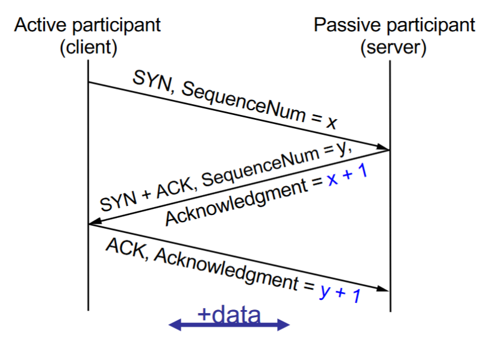

# Congestion Control
- Transport layer stuff usually happens at the kernel layer

### Applications for UDP
- Streaming media
- DNS
- NTP (Network Time Protocol)
- Online multiplayer games
- Why might UDP be appropriate be appropriate for these?
    - No need for it to be reliable all the time
    - Speed
        - We call these real-time applications

## Transmission Control Protocol

### Connection Establishment
- Three-way Handshake

### Connection Teardown
- TIME-WAIT State
- Wait two minutes
- Real life: Abortice close
    - Don't wait for two minutes, simply send reset packet

